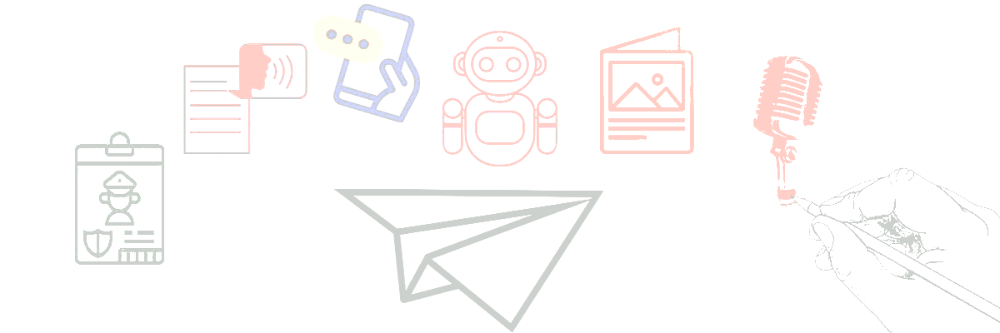

##  ̐Join my telegram channel ␐  https://t.me/cipher_attacks

<p align="center">
  <a href="README.md" style="text-decoration: none;">
    
  </a>
  <a href="README_AM.md" style="text-decoration: none;">
    
  </a>
</p>

<p align="center">
  
</p>

<h1 align="center">
  <span>PROJECT AKASHA</span>
</h1>

<p align="center">
  <span align="center">ለ telegram ተጠቃሚ የተሰራ፣ እውነተኛ ሰው የሚመስል ዘመናዊ የቴሌግራም UserBot ነው። በውስጡም neural AI engine፣ ጥራት ያለው Voice መቀያየሪያ፣ የሙዚቃ እና crative Tools ይዟል።</span>
</p>
<p align="center">
  <a href="#installation">አጫጫን</a>
  <span> · </span>
  <a href="#system-core">የሲስተሙ አሰራር</a>
  <span> · </span>
  <a href="#module-manual">የሞጁሎች ማኑዋል</a>
  <span> · </span>
  <a href="#troubleshooting">ችግሮችን ለመፍታት</a>
</p> 

<p align="center">
  
</p>

## መግቢያ

**Project Akasha** ማለት መደበኛ የቴሌግራም Userbot (Spam bot) ሳይሆን፣ የእናንተን የቴሌግራም እንቅስቃሴ እናንተ በሌላችሁበት ሰዓት ተረክቦ የሚያስተናግድ ሲስተም ነው። ዋናው ልዩነቱ፣ አካውንቱ "ቦት" መሆኑን የሚያጋልጡ ነገሮችን በማስወገድ፣ የሰዎችን ንግግር አውድ (Context) ተረድቶ ምላሽ መስጠቱ ነው።

በውስጡ የተሰራለት **neural engine** በ Google Gemini AI የሚታገዝ ሲሆን፣ **Master Voice** ሞጁል ደግሞ ጽሁፍን ወደ አማርኛ ወይም እንግሊዝኛ ድምፅ በመቀየር፣ እንደፍላጎትዎ effect እየጨመረ ይልካል።

## የፋይል አደረጃጀት (Project Structure)

ቦቱን ከመጫናችሁ በፊት፣ የፎልደሮች አቀማመጥ ትክክል መሆኑን አረጋግጡ። ሲስተሙ ፎንቶችን፣ ዳታቤዝ እና ፕለጊኖችን የሚያነበው በዚህ መልኩ ሲቀመጥ ነው።

```text
.
├── .env
├── config.py
├── main.py
├── requirements.txt
├── Dockerfile
├── docker-compose.yml
├── Procfile
├── setup.sh
├── LICENSE
├── core
│   └── database.py
└── plugins
    ├── admin_tools.py
    ├── ai.py
    ├── creative.py
    ├── master_voice.py
    ├── music.py
    ├── security.py
    └── system.py
```
<div id="installation"></div>

## ⚙ አጫጫን (Installation Guide)

Project Akashaን ለመጫን የሚከተሉትን ደረጃዎች ተከተሉ። ሚስጥራዊ ቁልፎችን (Keys) ለመጠበቅ **Environment Variables** እንጠቀማለን።

<details open>
<summary><strong>1. የሚያስፈልጉ ነገሮች (Prerequisites)</strong></summary>
<br/>

ኮምፒውተር ወይም ሰርቨር ላይ **Python 3.9+** እና **FFmpeg** መጫን አለበት።

**Ubuntu/Debian ላላችሁ:**
```bash
sudo apt update && sudo apt install python3 python3-pip ffmpeg -y
```

**Windows ላላችሁ:**
1. Pythonን ከ python.org አውርዱት።
2. FFmpeg አውርዱና System PATH ላይ ጨምሩ።
</details>

<details>
<summary><strong>2. ላይብረሪዎችን መጫን (Dependencies)</strong></summary>
<br/>

ተርሚናል (CMD) ፕሮጀክቱ ባለበት ፎልደር ውስጥ ይክፈቱና ይህንን ይጻፉ:

```bash
pip install -r requirements.txt
```
</details>

<details>
<summary><strong>3. ማስተካከያ (.env)</strong></summary>
<br/>

ዋናው ፎልደር ውስጥ `.env` የሚባል ፋይል ፍጠሩ።
**ማሳሰቢያ:** ቦቱ የ "API Key Rotation" ይደግፋል። ይህ ማለት አንድ ቁልፍ ሲዘጋበት ሌላ ይቀይራል። ቁልፎቹን አንድ ላይ (`GEMINI_KEYS`) ወይም ለየብቻ (`GEMINI_KEY1`...) ማስቀመጥ ይቻላል።

```ini
# --- TELEGRAM CORE ---
# ከ my.telegram.org የሚገኝ
API_ID=123456
API_HASH=your_api_hash
SESSION=1BVts... # Telethon String Session

# --- AI ENGINE (አንዱን ዘዴ ምረጡ) ---
# ዘዴ 1: በአንድ መስመር (ለ Render እና Secrets ይመረጣል)
# ቁልፎቹን በኮማ (,) ለዩ
GEMINI_KEYS=AIzaSy1...,AIzaSy2...,AIzaSy3...

# ዘዴ 2: ለየብቻ ማስቀመጥ
GEMINI_KEY1=AIzaSyD...
GEMINI_KEY2=AIzaSyF...
GEMINI_API_KEY=AIzaSy... # Fallback

# --- DATABASE ---
# ባዶ ከተዋቹሁት ሎካል ፋይል ይጠቀማል
MONGO_URL=
```

> **⚠︎ ማስጠንቀቂያ:** የ `.env` ፋይል ወይም `SESSION` ኮድ ለሌላ ሰው በፍፁም አታጋሩ።

</details>

<details>
<summary><strong>4. ማስጀመር</strong></summary>
<br/>

```bash
python main.py
```
*ሲነሳ `Config.check_integrity()` የሚለውን በመጠቀም ሁሉም ነገር በትክክል መሙላቱን ያረጋግጣል።*

</details>

<br/>

## ☁︎ ክላውድ ላይ መጫን (Cloud Deployment)

Render, Railway, ወይም Heroku የምትጠቀሙ ከሆነ `.env` ፋይል አያስፈልግም። በምትኩ ዳሽቦርዱ ላይ **Environment Settings** ውስጥ ገብታችሁ እነዚህን ሙሉ።
*   `API_ID`
*   `API_HASH`
*   `SESSION`
*   `GEMINI_KEYS` (ሁሉንም ቁልፎች እዚህ ላይ በኮማ እየለያችሁ ማስገባት ትችላላችሁ)።

<div id="system-core"></div>

## የሲስተሙ አሰራር (System Core)

የ Project Akasha ዋና የኦፕሬሽን ክፍል `plugins/system.py` ነው። እናንተ በማትኖሩበት ሰዓት ቦቱ እንዴት ፀባይ ማሳየት እንዳለበት (Behavior) የሚወስነው እዚህ ነው።

### Auto-Pilot Modes (`.auto`)
አውቶማቲክ ምላሽ (Reply) ሲስተሙን ለመቆጣጠር፡

| ኮማንድ | ተግባር |
| :--- | :--- |
| `.auto ai` | **Neural Mode:** ቦቱ Google Geminiን በመጠቀም እንደ አውዱ (Context aware) ምላሽ ይሰጣል። AI መሆኑን አይናገርም። |
| `.auto static` | **Static Mode:** ቦቱ እናንተ የምትሰጡትን ቋሚ መልዕክት ብቻ ይልካል (ለምሳሌ፦ "አሁን አይመቸኝም")። |
| `.auto off` | **Manual Mode:** ቦቱ ስራ ያቆማል። ሁሉንም ነገር እራሳችሁ ትቆጣጠራላችሁ። |
| `.auto [text]` | ለ Static Mode የሚሆነውን መልዕክት ለመወሰን። <br> *ለምሳሌ:* `.auto ጂም ነኝ በኋላ አወራሃለሁ።* |

### Context Modes (`.mode`)
`.auto ai` ላይ እያላችሁ ፣ ለ AIው ምን አይነት "Mood" (ስሜት) ላይ እንዳላችሁ መንገር ትችላላችሁ😊።

*   **አጠቃቀም:** `.mode [type]`
*   **አይነቶች:**
    *   `sleep` - AIው በሰነፍ እና አጭር መልስ ይመልሳል (እንቅልፍ ላይ እንዳለ ሰው)።
    *   `work` - ፕሮፌሽናል እና አጠር ያለ መልስ ይሰጣል (ቢዚ ነኝ አይነት)።
    *   `gaming` - ስሜት የሌለው ወይም በጣም አጭር መልስ (ጌም እየተጫወተ እንደተረበሸ ሰው)።
    *   `default` - መደበኛ፣ ጨዋ እና ፈታ ያለ ጨዋታ።

### የሰው ማስመሰል (Human Simulation)
ቦት መሆኑ እንዳያስታውቅ ሲስተሙ የሚከተሉትን ያደርጋል፡
1.  **Read Status:** ሜሴጁን "Read" ከማድረጉ በፊት እንደ ጽሁፉ ርዝመት ከ1-3 ሰከንድ ይቆያል።
2.  **Typing Status:** ፅሁፉን ለመፃፍ ምን ያህል ጊዜ እንደሚፈጅ አስልቶ፣ ለዛ ያህል ሰከንድ "Typing..." ያሳያል።

***

<div id="module-manual"></div>

## የሞጁሎች ማኑዋል

ይህ ክፍል እያንዳንዱን ፕለጊን በዝርዝር ያብራራል።

### 1. Admin Tools (`plugins/admin_tools.py`)
ግሩፖችን ለማስተዳደር እና የሰዎችን ማንነት ለመፈተሽ የሚጠቅሙ መሳሪያዎች።

#### **Identity Scan**
*   **ኮማንድ:** `.whois @username` ወይም ሜሴጅ ላይ ሪፕላይ አድርጋችሁ።
*   **ጥቅም:** ስለ ዩዘሩ ሙሉ ዝርዝር (ስም፣ ID፣ Username፣ Bio፣ DC) ስካን አድርጎ ያወጣል።

#### **Translator (ተርጓሚ)**
*   **ኮማንድ:** `[Text] //lang`
*   **አጠቃቀም:** ሜሴጁን ፅፋችሁ መጨረሻ ላይ `//` አድርጋችሁ የቋንቋውን ኮድ ማስገባት።
*   **ለምሳሌ:** `Good morning //am`
*   **ውጤት:** ቦቱ ሜሴጁን ወደ አማርኛ ቀይሮ "እንደምን አደራችሁ" ብሎ ይልካል።

#### **Moderation (መቆጣጠሪያ)**
*   **Purge:** `.purge` (ሪፕላይ አድርጋችሁ)። ሜሴጆችን ወደላይ ያጠፋል። *FloodWait እንዳትገቡ የራሱ Timer አለው።*
*   **Ban:** `.ban @user` ወይም ሪፕላይ አድርጋችሁ። ሰውየውን ከግሩፕ ያባርራል።
*   **Mute:** `.mute @user` ወይም ሪፕላይ አድርጋችሁ። ሰውየው ሜሴጅ እንዳይፅፍ ያግደዋል።
*   **Zombies:** `.zombies`። ግሩፑ ውስጥ ያሉ "Deleted Account" (የጠፉ አካውንቶችን) ፈልጎ ያጸዳል።

---

### 2. Master Voice (`plugins/master_voice.py`)
ይሄ ሞጁል Microsoft Edge TTS በመጠቀም ጽሁፍን ወደ ጥራት ያለው ድምፅ ይቀይራል። FFmpegን በመጠቀም ደግሞ ተጨማሪ የኦዲዮ ኢፌክቶችን ይጨምራል።

#### **የ `.say` ኮማንድ**
ቴክስት ወደ ቮይስ መቀየሪያ። ቋንቋው **አማርኛ** ወይም **እንግሊዝኛ** መሆኑን ራሱ ይለያል።

**ቀለል ያለ አጠቃቀም:**
`.say Hello እንዴት ነህ`

**Advanced Flags (ኢፌክት መጨመሪያ):**
ድምፁን ለመቀየር ከቴክስቱ ጋር እነዚህን "flags" መጨመር ይቻላል።

| Flag | ኢፌክት |
| :--- | :--- |
| `.f` | **የሴት** ድምፅ ይጠቀማል (መቅደስ ለአማርኛ፣ Jenny ለእንግሊዝኛ)። |
| `.m` | **የወንድ** ድምፅ ይጠቀማል (አሜሃ ለአማርኛ፣ Guy ለእንግሊዝኛ)። |
| `.echo` | ትልቅ አዳራሽ ውስጥ እንዳለ አስተጋቢ (Echo) ያደርገዋል። |
| `.radio` | የድሮ ሬድዮ ወይም የፖሊስ ስልክ ነገር ያስመስለዋል ይሄ ለኔ good ነው ። |
| `.demon` | ድምፁን ያወፍረዋል/ያቀጥነዋል። (Deep voice) |
| `.kid` | የህፃን ልጅ ወይም Chipmunk ያስመስለዋል። |
| `.slow` | ንግግሩን ያዘግየዋል (0.7x)። |
| `.fast` | ንግግሩን ያፈጥነዋል (1.5x)። |

**ምሳሌዎች:**
*   **የሚያስፈራ:** `.say .m .demon .echo አንተ ማን ነህ?`
*   **ፈጣን ሬድዮ:** `.say .f .fast .radio copy that, moving out.`

---

### 3. Creative Studio (`plugins/creative.py`)
ለፈጠራ ስራዎች እና ለመዝናኛ የሚሆኑ መሳሪያዎች።

#### **Meme Generator**
*   **ኮማንድ:** `.meme [የላይኛው ጽሁፍ];[የታችኛው ጽሁፍ]`
*   **አጠቃቀም:** ፎቶ ላይ ሪፕላይ አድርጋችሁ።
*   **ቴክኒካል:** 
    *   **Global Fonts**ን ይደግፋል። አማርኛ ከፃፋችሁ ፣ ቦቱ `NotoSansEthiopic-Bold`ን አውርዶ ይጠቀማል።
    *   እነዚህ ፎንቶች ከሌሉ ቦቱ ራሱ አውርዶ `resources/global_fonts` ውስጥ ያስቀምጣቸዋል።

#### **Sticker Kang**
*   **ኮማንድ:** `.kang`
*   **አጠቃቀም:** ፎቶ ወይም ስቲከር ላይ ሪፕላይ አድርጋችሁ።
*   **ጥቅም:** ፎቶውን ወደ `.webp` ስቲከር ቀይሮ ይልከዋል።
*   **ገደብ:** ራም (RAM) እንዳይጨናነቅ ከ5MB በላይ የሆኑ ፋይሎችን አይቀበልም።

---

### 4.Music System (`plugins/music.py`)
RAM ለመቆጠብ እና ፍጥነትን ለመጨመር፣ ስራውን በሁለት ስቴፕ የሚሰራ የሙዚቃ ማውረጃ።

**Step 1: ፍለጋ (Search)**
*   **ኮማንድ:** `.song [Title]`
*   **ምሳሌ:** `.song the weeknd starboy`
*   **ድርጊት:** ቦቱ **SoundCloud** ላይ ይፈልጋል (`yt-dlp` በመጠቀም)። ገና አያወርደውም። ምርጥ 5 ውጤቶችን ያመጣላችኋል በዛ ዕርስ ካለ።

**Step 2: ማውረድ (Download)**
*   **ተግባር:** ከመጡት ምርጫዎች `1`፣ `2`፣ `3`፣ `4`፣ ወይም `5` ብለህ ሪፕላይ ታደርጋለህ።
*   **ሂደት:** ቦቱ የመረጥከውን ብቻ አውርዶ፣ በ FFmpeg ወደ **MP3 192kbps** ቀይሮ፣ Metadata (Cover art, Artist) ሞልቶ ይልካል።

> **ማሳሰቢያ:** ከ50MB በላይ የሆኑ ፋይሎች በቴሌግራም Upload ችግር ምክንያት አይወርዱም እና ቶሎ download ካላደረጋችሁ system crush ሊያጋጥም ይችላል 

---

### 5. AI & Search (`plugins/ai.py`)

#### **Generative AI**
*   **ኮማንድ:** `.ai [question]`
*   **ቴክኖሎጂ:** Google Gemini ይጠቀማል።
*   **Persona:** ሲስተሙ "እውነተኛ ሰው" እንደሆነ እና "AI" መሆኑን እንዳይናገር ታዟል።
*   **Vision:** ፎቶ ላይ ሪፕላይ አድርጋቹ`.ai explain this` ብትለው፣ ፎቶውን አውርዶ ምን እንደሆነ ያብራራላችኋል።

#### **Image Search (የፎቶ ፍለጋ)**
*   **ኮማንድ:** `.img [query]` (አንድ ፎቶ)
*   **ኮማንድ:** `.imgs [query]` (የጋለሪ አልበም - እስከ 9 ፎቶ)
*   **ጥቅም:** DuckDuckGo ላይ ፎቶ ይፈልጋል።
*   **አሰራሩ:** በጣም ገራሚ ገራሚ የሆኑ photo search ባደረጋችሁት ዕርስ መርጦ ያመጣል በጣም ጥራት አለው 
     ለምሳሌ - .img addis abeba or .imgs addis abeba

---

### 6. Security & Vault (`plugins/security.py`)

#### **Vault Guardian (Anti-View-Once)**
ይሄ **Passive Feature** ነው። ኮማንድ አያስፈልገውም።
*   **አሰራር:** ማንም ሰው ፕራይቬት ቻት (PV) ላይ "View Once" (አንዴ ታይቶ የሚጠፋ) ፎቶ ወይም ቮይስ ቢልክላችሁ ፣ ቦቱ በድብቅ አውርዶ ወደ እራሳችሁ**Saved Messages** ፎርዋርድ ያደርገዋል።

#### **Fake Hack**
*   **ኮማንድ:** `.hack` (ሰው ላይ ሪፕላይ አድርጋችሁ)
*   **ጥቅም:** ለመዝናኛ የሚሆን prank። ሜሴጁን ደጋግሞ ኤዲት በማድረግ ልክ ተርሚናል ላይ ሀክ እያደረገ ያስመስላል።

> [!WARNING]
> **ማስጠንቀቂያ:**
> * **warn:** እዚህ ላይ ለሚፈፀመው ማንኛውንም ችግር ባለቤቱ የለበትም account መዘጋትም ሆነ ሌላ ነገር በራሳችሁ ፍቃድ እና ውሳኔ ገብታችሁ true ባማድረግ የምታበሩት ነው ለ ትምህርታዊ አላማ ብቻ ነው የተቀመጠው 

---

> [!TIP]
> **ጠቃሚ ምክሮች:**
> * **Moods:** `.mode` (sleep, work, gaming) በመጠቀም ቦቱ ለሰዎች የሚሰጠውን መልስ ማስተካከል ይቻላል።
> * **Rate Limiting:** Gemini API key እንዳይዘጋባችሁ AIው የራሱ የሆነ ማቀዝቀዣ (Cooldown) አለው (14 RPM)።
> * **Human Simulation:** ቦቱ ልክ እንደ ሰው የመፃፊያ ፍጥነት ስለሚጠቀም፣ አውቶሜሽን መሆኑ በቀላሉ አይታወቅም።

**ስለ View-Once (Anti-View-Once) Saver:**

ይህ ቦት View-Once ሚዲያዎችን ሴቭ ማድረግ የሚችል `security.py` ሞጁል አለው። 
**ነገር ግን ለደህንነትህ ሲባል፣ ይህ ፊውቸር በነባሪ (Default) ተዘግቶ (`False`) ነው የሚመጣው።**

ይህንን ማብራት በቴሌግራም ህግ መሰረት አካውንት ሊያዘጋ ይችላል። ለማብራት (በራሳችሁ ኃላፊነት):
1. `plugins/security.py` ፋይልን ክፈቱ።
2. `ENABLE_VIEW_ONCE = False` የሚለውን ወደ `True` ቀይሩት።
3. ቦቱን restart አድርጉ።

---

<div id="troubleshooting"></div>

## 🔧 ችግሮችን ለመፍታት (Troubleshooting)

**1. FFmpeg Error:**
`.say` ወይም `.song` መስራት ካልቻለ፣ FFmpeg አልተጫነም ማለት ነው። ተርሚናል ላይ `ffmpeg -version` ብላችሁ ቼክ አድርጉ።

**2. API Key Error:**
`.ai` ስትጠቀሙ "No API Keys" ካላችሁ ፣ `.env` ውስጥ Key መኖሩን አረጋግጡ ዎይም እየሰራ ያለ API መሆኑን አረጋግጡ።

**3. Dependency Missing:**
`ModuleNotFoundError` የሚል ካያችሁ፣ `pip install -r requirements.txt` የሚለውን ድጋሚ ራን አድርጉት ።

**4. unknown mistake :**
`read in the log` ማንኛውንም የማታውቁት ችግር ከመጣ terminal ላይ ዎይም host ያደረጋችሁበት server log ላይ በማየት በቀላሉ ችግሩን ማዎቅ.እና መፍታት ትችላላችሁ።

<br/>
<p align="center">
  <a href="https://t.me/cipher_attacks">
    
  </a>
  <a href="https://github.com/Biruk-Getachew">
    
  </a>
  <a href="#">
    
  </a>
</p>

<p align="center">
  Licensed under the <a href="./LICENSE">MIT License</a>.
</p>

<p align="center">
  <b>Project Akasha v1.0</b><br>
  <i>Built for the Unknown purpose ☕︎.</i>
</p>